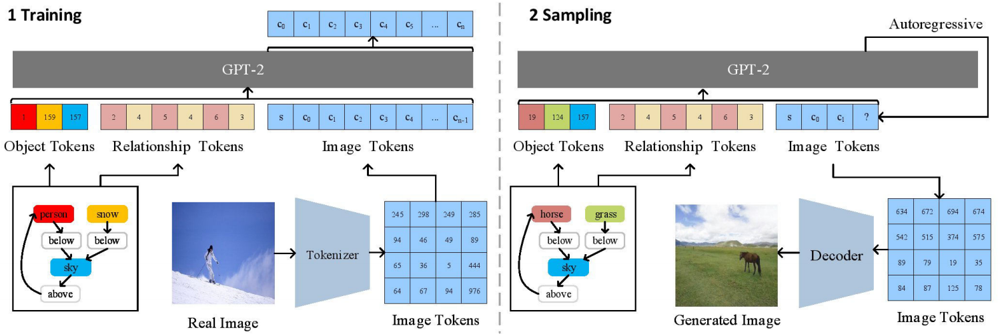

# HIGH-QUALITY IMAGE GENERATION FROM SCENE GRAPHS WITH TRANSFORMER
##### ICME 2022

[Paper download](https://ieeexplore.ieee.org/abstract/document/9859841)https://ieeexplore.ieee.org/abstract/document/9859841


## Requirements
A suitable [conda](https://conda.io/) environment named `taming` can be created
and activated with:

```
conda env create -f environment.yaml
conda activate taming
```
## Overview of pretrained models
The following table provides an overview of all models that are currently available. 
FID scores were evaluated using [torch-fidelity](https://github.com/toshas/torch-fidelity).
For reference, we also include a link to the recently released autoencoder of the [DALL-E](https://github.com/openai/DALL-E) model. 
See the corresponding [colab
notebook](https://colab.research.google.com/github/CompVis/taming-transformers/blob/master/scripts/reconstruction_usage.ipynb)
for a comparison and discussion of reconstruction capabilities.

| Dataset  | FID vs train | FID vs val | Link |  Samples (256x256) | Comments
| ------------- | ------------- | ------------- |-------------  | -------------  |-------------  |
| VQGAN ImageNet (f=16), 1024 |  10.54 | 7.94 | [vqgan_imagenet_f16_1024](https://heibox.uni-heidelberg.de/d/8088892a516d4e3baf92/) | [reconstructions](https://k00.fr/j626x093) | Reconstruction-FIDs.
| VQGAN ImageNet (f=16), 16384 | 7.41 | 4.98 |[vqgan_imagenet_f16_16384](https://heibox.uni-heidelberg.de/d/a7530b09fed84f80a887/)  |  [reconstructions](https://k00.fr/j626x093) | Reconstruction-FIDs.
| VQGAN OpenImages (f=8), 8192, GumbelQuantization | 3.24 | 1.49 |[vqgan_gumbel_f8](https://heibox.uni-heidelberg.de/d/2e5662443a6b4307b470/)  |  ---  | Reconstruction-FIDs.
| | |  | | || |
| DALL-E dVAE (f=8), 8192, GumbelQuantization | 33.88 | 32.01 | https://github.com/openai/DALL-E | [reconstructions](https://k00.fr/j626x093) | Reconstruction-FIDs.


## VQGAN Training on custom data

Training on your own dataset can be beneficial to get better tokens and hence better images for your domain.
Those are the steps to follow to make this work:
1. install the repo with `conda env create -f environment.yaml`, `conda activate taming` and `pip install -e .`
1. put your .jpg files in a folder `your_folder`
2. create 2 text files a `xx_train.txt` and `xx_test.txt` that point to the files in your training and test set respectively (for example `find $(pwd)/your_folder -name "*.jpg" > train.txt`)
3. adapt `configs/custom_vqgan.yaml` to point to these 2 files
4. run `python main.py --base configs/custom_vqgan.yaml -t True --gpus 0,1` to
   train on two GPUs. Use `--gpus 0,` (with a trailing comma) to train on a single GPU.

## Training models 

### sketch transformer
Train a sketch transformer
```
python main.py --base configs/sketch_transformer.yaml -t True --gpus 0,1,2,3
```

### font transformer
Train a font vggan
```
python main.py --base configs/font_vqgan.yaml -t True --gpus 0,1,2,3
```
Train a font transformer
```
python main.py --base configs/font_transformer.yaml -t True --gpus 0,1,2,3
```
Train a small font transformer
```bash
python main.py --base configs/font_transformer_small.yaml -t True --gpus 0,1,2,3
```
### sg transformer in vg
Train a sg transformer in visual genome dataset
```
python main.py --base configs/sg_transformer_vg_135.yaml -t True --gpus 0,1,2,3
```

### sg transformer in coco 
Train a sg transformer in coco dataset using (f8 1024) vqgan
```
python main.py --base configs/sg_transformer_coco_135.yaml -t True --gpus 0,1,2,3
```
Train a sg transformer in coco dataset using (f16 16384) vqgan
```
python main.py --base configs/sg_transformer_coco_135_f16_16384.yaml -t True --gpus 0,1,2,3
```
Test the sg transformer in coco dataset
```
python scripts/samples_condition_sg.py -r logs/2021-11-09--04-13-39_sg_transformer_coco_135/
```

###  score calculate
```
#使用 0号GPU加速计算 
fidelity --gpu 0 --isc --input1 img_dir1/

#使用 0,1,2,3号GPU加速计算 
fidelity --gpu 0,1,2,3 --isc --input1 img_dir1/

#FID
fidelity --gpu 0 --fid --input1 img_dir1/ --input2 img_dir2/

#KID
fidelity --gpu 0 --kid --input1 img_dir1/ --input2 img_dir2/
```
### simple object transformer
```
python main.py --base configs/simple_object_transformer.yaml -t True --gpus 0,1,2,3
```


## 引用
BibTeX
```
@inproceedings{zhao2022high,
  title={High-Quality Image Generation from Scene Graphs with Transformer},
  author={Zhao, Xin and Wu, Lei and Chen, Xu and Gong, Bin},
  booktitle={2022 IEEE International Conference on Multimedia and Expo (ICME)},
  pages={1--6},
  year={2022},
  organization={IEEE}
}
```
GB/T 7714
```
Zhao X, Wu L, Chen X, et al. High-Quality Image Generation from Scene Graphs with Transformer[C]//2022 IEEE International Conference on Multimedia and Expo (ICME). IEEE, 2022: 1-6.
```
MLA
```
Zhao, Xin, et al. "High-Quality Image Generation from Scene Graphs with Transformer." 2022 IEEE International Conference on Multimedia and Expo (ICME). IEEE, 2022.
```
APA
```
Zhao, X., Wu, L., Chen, X., & Gong, B. (2022, July). High-Quality Image Generation from Scene Graphs with Transformer. In 2022 IEEE International Conference on Multimedia and Expo (ICME) (pp. 1-6). IEEE.
```


